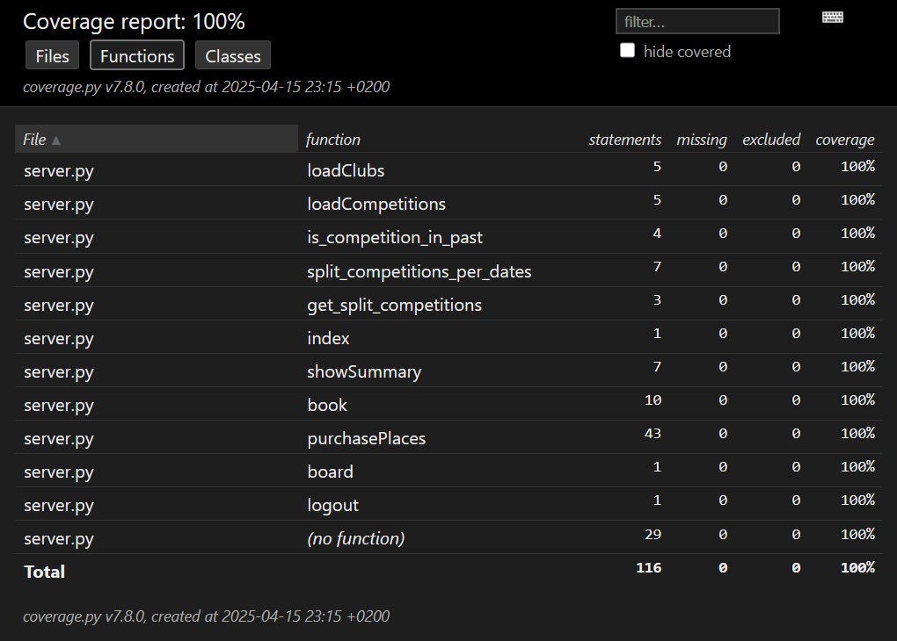
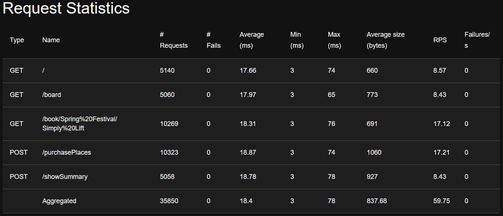
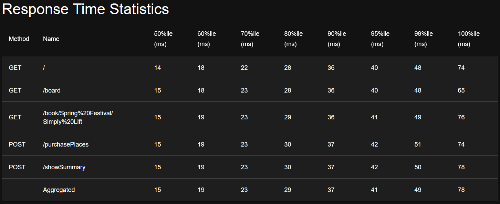
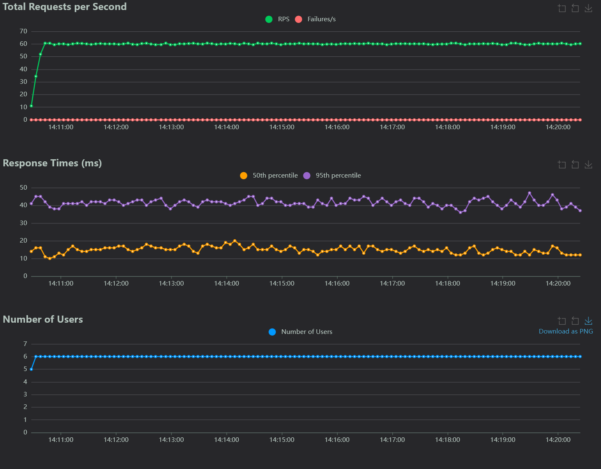

<p align="center">
    
</p>

# Gudlift - Project 11

Eleventh project for the online course of Python application development on 
OpenClassroom.

## Table of Contents
- [Description](#description)
- [Disclaimer](#-disclaimer--the-qa-branch)
- [Installation & Launch](#installation--launch)
- [Testing](#testing)

## Description

This is a proof of concept (POC) project to show a light-weight version of 
our competition booking platform. The aim is the keep things as light as 
possible, and use feedback from the users to iterate.

## ⚠️ Disclaimer : The QA branch
This branch aims to be used as the result of the QA department investigation 
and improvement of the codebase left by the previous Developer and forked from
this repository : [Python_testing](https://github.com/OpenClassrooms-Student-Center/Python_Testing).

This branch provides a complete suite of tests to verify the integrity, 
functionality and performance of the written code. Tests were conducted on Windows 10 
using Firefox when browser automation was required, as it offers better compliance
with W3C guidelines.


## Installation & Launch

Ensure you have the following installed on your system:

- [Python 3.7+](https://www.python.org/downloads/)
  - Tested with Python 3.12, should work on Python 3.7+.

### Steps to Install

**1. Clone the project or download the files to your local machine:**

```
git clone --branch QA https://github.com/a-beduc/formation_project_11
```

**2. Create a virtual environment:**
   ```
   python -m venv .venv
   source .venv/bin/activate  # Linux
   .venv\Scripts\activate     # Windows
   ```

**3. Install dependencies:**
   ```
   pip install -r requirements.txt
   ```

**4. Flask env**

Flask requires that you set an environmental variable to the python file. 
However, you do that, you'll want to set the file to be <code>server.py</code>. 
Check [here](https://flask.palletsprojects.com/en/1.1.x/quickstart/#a-minimal-application) for more details.

**5. Start the app**

```
flask --app server run --debug
``` 
The app should respond with an address you should be able to go to using your browser.

### Current Setup

The app is powered by [JSON files](https://www.tutorialspoint.com/json/json_quick_guide.htm). 
This is to get around having a DB until we actually need one. The main ones are:
     
* competitions.json - list of competitions 
* clubs.json - list of clubs with relevant information. You can look here to see what email addresses the app will accept for login.


## Testing

### Tools used
* `pytest`
* `pytest-flask`
* `pytest-mock`
* `selenium`
* `locust`
* `pytest-cov`

### Tests Architecture
``` 
tests/
├── conftest.py
├── functional/
│   └── test_functional_server.py
├── integration/
│   ├── test_board.py
│   ├── test_login.py
│   └── test_purchase_places.py
├── performance/
│   └── locustfile.py
└── unit/
    └── test_server.py
```

### Unit tests
These tests can be executed with the Pytest command:
```
pytest tests/unit/
```

### Integration tests

These tests can be executed with the Pytest command:

```
pytest tests/integration/
```

### Functional tests

Since some tests use Firefox, you want to download the appropriate driver: 
[GeckoDriver](https://github.com/mozilla/geckodriver/releases).

If you want to use another driver, you may modify the tests found in the file [test_functional_server.py](tests/functional/test_functional_server.py)

The functional tests are quite slow but should take less than a minute.
They will be executed with the command:

```
pytest tests/functional/
```

### Performance tests
For the performance tests, you may want to use two terminal one to launch 
the server application and one to launch the [Locust](https://locust.io/) application.

Start the server app you want to test:
```
flask --app server run
```

In another terminal start the locust app:
```
locust -f tests/performance/locustfile.py
```
Locust should provide a url to reach a web interface for Locust.
You want to provide the Host URL for the Flask app you want to test, 
and complete test configuration as needed (Number of users / Run time etc...)


### Tests Results

#### Coverage
You can find the generated html report for the coverage in the directory : [htmlcov](/htmlcov)
<p>

</p>


#### Locust
Tests made with 6 concurrent users each one limited at 10 requests per seconds.




